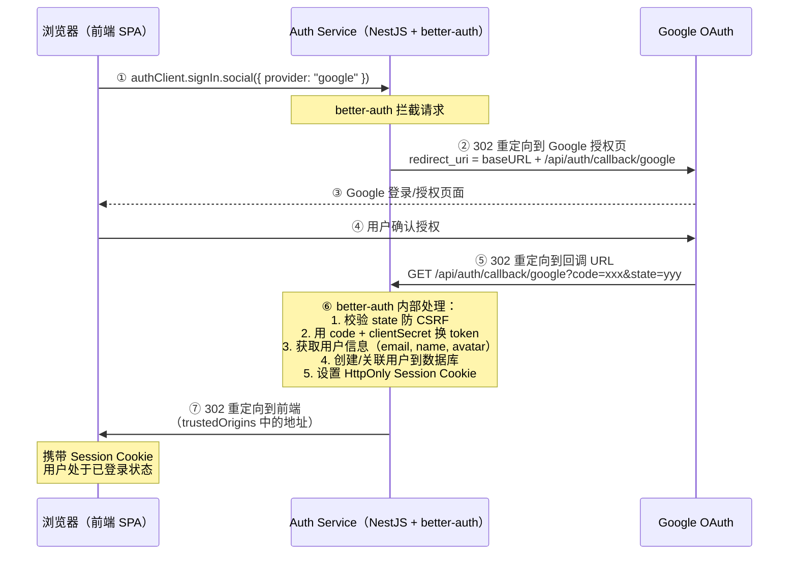

# better-auth Google OAuth 完整回调流程

## 概述

better-auth 作为嵌入式认证库，将 OAuth 2.0 Authorization Code Flow 完全封装在框架内部。开发者无需手动编写回调处理逻辑，只需正确配置 `baseURL`、`trustedOrigins` 和 OAuth Provider 凭证即可。

## 核心内容

### 完整流程（7 步详解）



### 各步骤详解

| 步骤 | 触发方 | 端点 | 说明 |
|------|--------|------|------|
| ① | 前端 | `authClient.signIn.social()` | better-auth 客户端 SDK 发起 |
| ② | 后端 | `GET /api/auth/sign-in/google` | better-auth 自动挂载的路由，构造 Google OAuth URL 并 302 |
| ③ | Google | Google 授权页 | 用户在 Google 页面完成登录/授权 |
| ④ | 用户 | Google 授权确认 | 用户点击"允许" |
| ⑤ | Google | `GET /api/auth/callback/google?code=xxx` | **这是 Google Cloud Console 中配置的 redirect URI** |
| ⑥ | 后端 | better-auth 内部回调处理器 | 框架自动完成 token 交换、用户创建/关联、session 设置 |
| ⑦ | 后端 | 302 → 前端 | 重定向目标由 `callbackURL` 参数或 `trustedOrigins` 决定 |

### 关键配置项

```bash
# auth.env — BitRes Auth Service 的 OAuth 配置
BETTER_AUTH_URL=http://localhost:3001       # ⑥⑦ 步的关键：构造 redirect_uri 和重定向目标
GOOGLE_CLIENT_ID=<client-id>               # Google Cloud Console 获取
GOOGLE_CLIENT_SECRET=<client-secret>       # Google Cloud Console 获取
CORS_ORIGIN=http://localhost:5173           # 前端地址，用于 CORS 和 trustedOrigins
```

```typescript
// auth.ts — better-auth 配置
betterAuth({
  baseURL: process.env.BETTER_AUTH_URL,           // → 构造 redirect_uri
  trustedOrigins: [process.env.CORS_ORIGIN],       // → 步骤⑦ 的重定向目标白名单
  socialProviders: {
    google: {
      clientId: process.env.GOOGLE_CLIENT_ID,
      clientSecret: process.env.GOOGLE_CLIENT_SECRET,
    },
  },
})
```

### Google Cloud Console 配置

在 Google Cloud Console → APIs & Services → Credentials → OAuth 2.0 Client ID → Authorized redirect URIs 中添加：

| 环境 | Redirect URI |
|------|-------------|
| 本地开发 | `http://localhost:3001/api/auth/callback/google` |
| 生产环境 | `https://<your-domain>/api/auth/callback/google` |

### better-auth 与其他 OAuth 实现的差异

- **传统自建**：需要手动编写 `/callback` 路由处理器，手动调用 token endpoint，手动管理 state/session
- **better-auth**：框架自动挂载回调路由，自动处理 token 交换、用户 upsert、session 管理，开发者只需配置凭证
- **Passport.js**：需要 Strategy 配置 + 回调路由 + Session 序列化，比 better-auth 多约 3 倍代码量

### 特殊场景：GitHub 私有邮箱

当 OAuth Provider 不返回邮箱时（如 GitHub 用户的 email 设为 private），better-auth 的 `databaseHooks.user.create.before` 会抛出 `EMAIL_REQUIRED_FOR_OAUTH` 错误。此时需要走补充邮箱流程（BitRes 中对应 `POST /api/oauth/complete-oauth-signup`）。

## 注意事项

- `baseURL` 必须包含协议（`http://` 或 `https://`），不能省略
- `trustedOrigins` 用于步骤⑦的重定向安全检查，防止开放重定向漏洞（open redirect）
- 生产环境 `BETTER_AUTH_URL` 必须改为真实域名，否则 Google 回调会失败
- 步骤⑤的 URL 必须**精确匹配** Google Cloud Console 中配置的 redirect URI（包括协议、域名、端口、路径）
