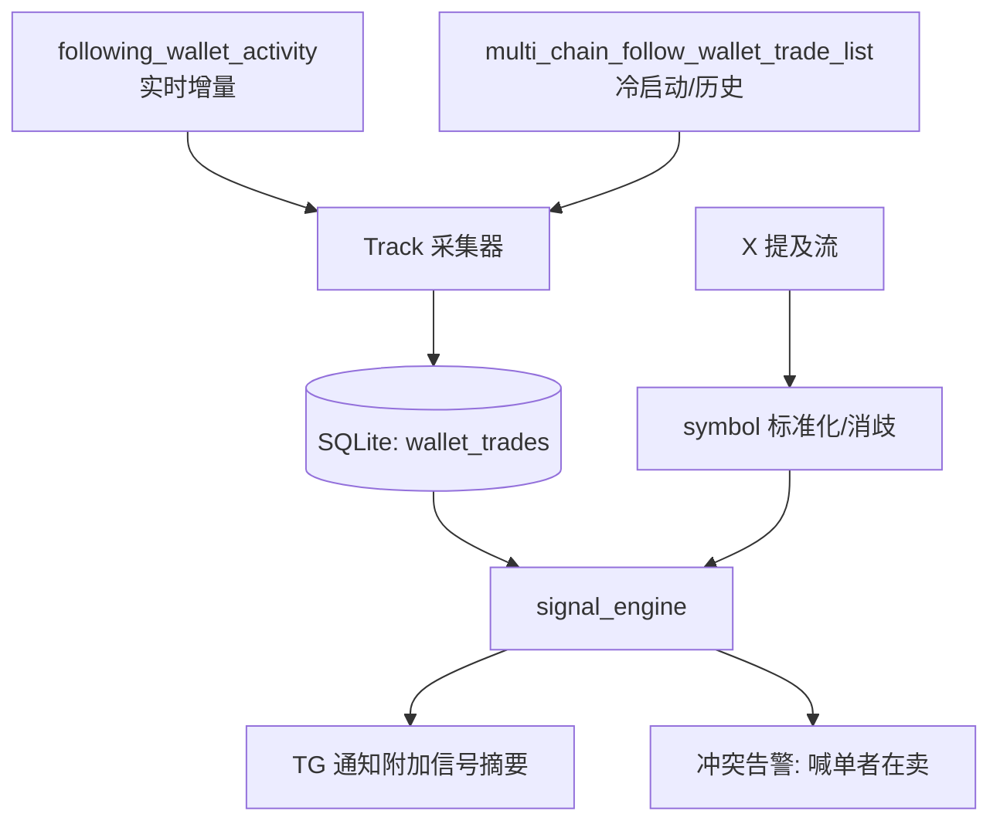

# 买卖策略模型：信号共振 + 加权净资金流评分 + 仓位分层

## 定义

一套将「社交叙事信号（X 提及/喊单）」与「链上资金流信号（被追踪 KOL/Smart Money 钱包的买卖记录）」结合，产出**标的优先级排序**与**风险识别**的交易辅助模型。模型输出的是**决策支持**（该关注谁、警惕谁），不是自动化预测；仓位由独立的风控规则决定（见相关页 `weight-vs-position`）。

## 核心思想

### 信号共振（Signal Confluence）

X 提及是叙事信号（谁在喊、说了什么），Track 买卖是资金流信号（谁真金白银动手了）。两者互补，业界不单用其一：

| | X 提及 | Track 买卖 |
|---|---|---|
| 信息 | 谁在喊、说了什么 | 谁真金白银动手了 |
| 弱点 | 喊单≠买入，可能配合出货 | 滞后、只覆盖被追踪钱包 |
| 结合点 | 叙事给出「关注候选」 | 资金流给出「确认/证伪」 |

模型回答四个问题：**谁在买？买了多少？何时买的（喊单前埋伏 vs 喊单后跟进）？喊单者自己是否言行一致？** 核心价值不是预测涨跌，而是**排序优先级 + 识别陷阱**。

### 加权净资金流评分（Weighted Net Flow Score）

**不推荐**「买入笔数 − 卖出笔数」这类简单模型。建议公式：

$$
\text{Score}(token, t) = \underbrace{\sum_{i} \underbrace{w(t-t_i)}_{\text{时间衰减}} \cdot \underbrace{q_i}_{\text{钱包信用分}} \cdot \underbrace{s_i}_{\text{buy=+1, sell=-1}} \cdot \underbrace{usd_i}_{\text{成交额}}}_{\text{净资金流}} \times \underbrace{f_{\text{分散度}}}_{\text{钱包数调制}} \times \underbrace{g_{\text{一致性}}}_{\text{言行一致}}
$$

| 组件 | 实现建议 | 理由 |
|---|---|---|
| 时间衰减 $w(\Delta t)$ | 半衰期（half-life）≈ 2h 的指数衰减 | 近因优先，meme 币生命周期短 |
| 钱包信用分 $q_i$ | 由历史 P&L / 胜率归一化，`wash_trader` 惩罚 ×0.1 | 洗盘交易者会制造假信号 |
| 分散度 $f$ | $\min(1, N_{buyers}/K)$，如 $K=5$ | 5 个钱包各买 2k 比 1 个买 10k 信号强 |
| 一致性 $g$ | 喊单 handle↔wallet 映射：喊单者自买 ×1.5；喊单者自卖 ×0（直接否决该信号） | 识别「喊单出货」是最重要的反信号 |
| 反洗盘闸门 | `honeypot` 字段 + 同一钱包对同 token 快进快出检测 | 直接过滤而非仅降权 |

**输出不是单一数字，而是结构化信号**：

```
MentionSignal{
  token, chain,
  buy_pressure, sell_pressure, net_flow,
  top_buyers[],      # 谁在买、买多少、成本价
  matched_wallets[], # 已追踪钱包里的相关买卖
  conflicts[]        # 喊单者自己在卖 = 冲突告警
}
```

### 仓位管理四层分离

权重决定**该不该关注、优先级多高**，**绝不直接决定仓位**。执行层走固定风控规则（对标 copy trading bot 实践）：

- **单 token 仓位上限**：如总资金 5–10%，防止单一标的过度暴露
- **分批建仓**：首仓 1/3，信号确认（如 SM 继续买）后再加
- **每日/单笔亏损熔断（circuit breaker）**：触发即停止当日交易
- **冷却期（cooldown）**：防止 FOMO 连续追高
- **滑点保护（slippage limit）**：meme 币流动性差，市价单会被插针
- **纸面交易（paper trading）先行**：所有信号入库，记录每笔 entry/exit/P&L，**用真实结果反哺钱包信用分**——这是权重模型可持续优化的唯一闭环

## 数据来源特征（GMGN Track）

- 实时增量：WS 频道 `following_wallet_activity`（v2/ws 主线程，秒级，`page.on("websocket")` 可捕获）
- 初始/历史：REST `multi_chain_follow_wallet_trade_list`（冷启动，`next_page_token` 翻页）
- 关联键：`transaction_hash`（WS `h`）；同 tx 多 token 帧 → 去重键 = tx hash + token 地址
- 动作枚举：`buy` / `sell` / `callOut`（喊单，非交易）/ `transferIn`（被动转入）/ `transferOut`（被动转出）；**只有 buy/sell 是主动成交，transfer 类不可当买卖信号**
- 帧状态 `cnt`：`""`（初始）/ `processed`（首帧）/ `confirm`（终帧字段最全，含 holder 聚合统计）
- 钱包画像：`maker_info.tags`（`kol`/`wash_trader`/`top_followed`）+ `balance_info`（`realized_profit`/`avg_cost`/`holding_percentage`）——**现成的信用特征来源**

## 前置工程问题：symbol 消歧

X 提及的是 symbol（如 `$STONKS`），Track 记录含 token 地址 + symbol。同名 symbol 多链多 token，必须消歧：

- 优先用合约地址关联（GMGN 推文数据里的 `symbol` 字段等）
- 否则用「chain + 时间窗口 + token 发行时间（`bct`）」组合消歧

## 落地架构



1. **数据层**：SQLite 新增 `wallet_trades` 表（透传 WS 全部帧：`cnt`/`h`/链/token 地址/`bs` symbol/`cu` USD/钱包/`tags` 等，去重键 tx+token），`wallet_meta` 表存钱包信用分（REST `balance_info` 周期性刷新）。索引 `(symbol, chain, ts)` 与 `(token_address, chain, ts)`。
2. **关联层**：X 提及 symbol 标准化后查表（见 symbol 消歧）。
3. **计算层**：`signal_engine.py` 实现评分，输出 `MentionSignal`，在现有异步翻译/分析链路之后追加到 TG 消息。

## 必须诚实面对的局限

- **样本偏差**：只覆盖被追踪钱包，不是全市场——无信号 ≠ 无机会
- **跟随滞后**：看到 SM 买入时可能已在半山腰，meme 币尤其
- **KOL 也会错**：`wash_trader` 标签需时间验证，信用分靠历史 P&L 积累
- **权重只做排序，不承诺盈利**：作用是「把有限注意力/资金投向证据更足的标的」+「识别言行不一的反向陷阱」

## 相关概念

- [[concepts/weight-vs-position]] — 权重只排序、不直接定仓位（本模型的架构决策）

## 出现在

- GmgnTwitterTGAlert 会话（2026-08-13）：讨论 track 数据如何辅助 X 提及的买卖决策

## 来源

- context7: /bscsmartdev/polymarket-copy-trading-bot（仓位/风控实践：TRADE_MULTIPLIER、SLIPPAGE_MAX、COOLDOWN、daily loss limit、circuit breaker、paper trading）
- 本仓库 spike：doc/spikes/api-gmgn-track-wallet-trade-datasource-spike.md（GMGN Track 数据源字段/动作/帧状态实证）
- [unverified] trading-strategy-ai 框架仅浅层查阅，回测环节未深入
